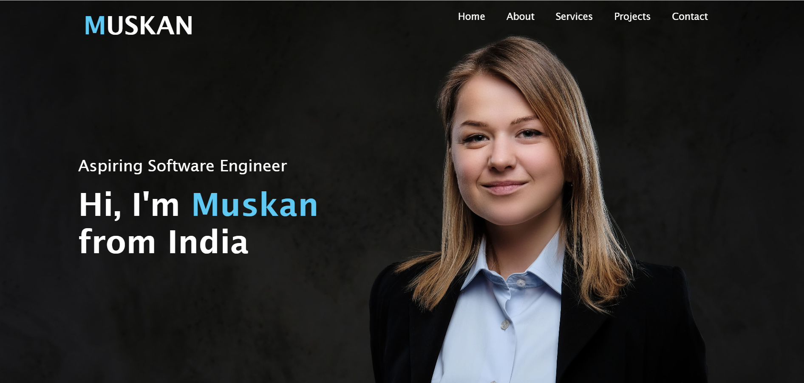

Portfolio Website

Overview
This is a personal portfolio website showcasing my projects, skills, education, and achievements. The website is built using HTML and CSS, with an emphasis on a clean, responsive, and user-friendly design.

Features
Responsive Design: Adapts seamlessly to different screen sizes and devices.
Interactive Animations: Smooth transitions and animations for better user experience.
About Me Section: A detailed introduction with an image and bio.
Skills Section: Highlights of my technical and soft skills.
Projects Showcase: A gallery of my best projects with links to live demos and repositories.
Education and Certifications: Academic background and professional certifications.
Contact Section: Links to email and social media for networking.

Technologies Used
HTML5: For creating the structure of the website.
CSS3: For styling, animations, and responsiveness.
Font Awesome: For icons.

Setup Instructions
1.Clone the repository:
git clone https://github.com/yourusername/your-portfolio-repo.git
2.Navigate to the project directory:
cd your-portfolio-repo
3.Open the index.html file in any modern browser.

Folder Structure
|-- index.html       # Main HTML file
|-- style.css        # Main CSS file
|-- images/          # Folder for images
|-- README.md        # Project documentation

Screenshots for your refernece:

Here is a preview of the homepage of the portfolio website:

